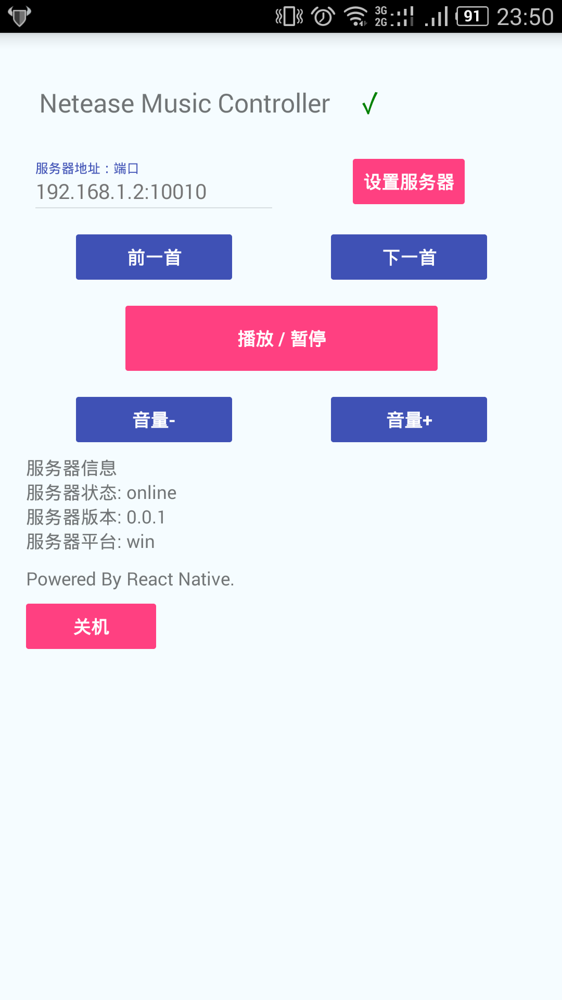

NetEaseMusicController
------------------------------

躺在床上控制控制PC上的网易云音乐，再也不用下床换歌关机了！

太穷买不起遥控器只能写程序，Boom！

##Config

### 1. 下载/运行
从这个地方下载客户端和服务端

地址: https://github.com/winkidney/NetEaseMusicController/releases/tag/0.0.2

然后打开程序，运行，会启动一个运行在10010端口的web服务器

### 2. 配置你的网易云音乐快捷键
记得配置并勾选你的全局快捷键:)


### 3. 访问服务器


#### 浏览器
在windows的任何地方查看你机器的IP地址，然后再手机浏览器里输入例如：

```
http://192.168.1.4:10010
```

就可以访问控制器页面了，Enjoy！


#### 客户端
安装并打开NaiveClient

输入服务器地址，点击“设置服务器”

```
192.168.1.4:10010
```



## 备注

关机功能仅支持 Windows 平台。

## 关于
Android Client和Mac版：[gucheen](https://github.com/gucheen)
Windows版：[winkidney](https://github.com/winkidney)

